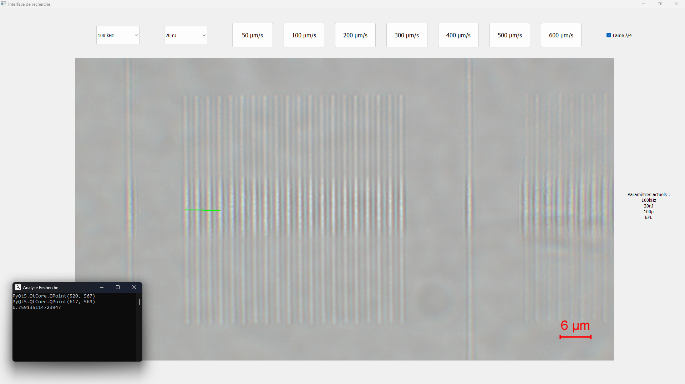

# Interface Recherche



# Fonctionnement

Cette interface rapide a été développée dans le but de faciliter la visualisation et l'analyse des effets des différents paramètres d'inscription. Grâce à une interface intuitive, l'utilisateur peut rapidement observer l'influence des ajustements de ces paramètres sur l'image. De plus, l'interface offre la possibilité de réaliser des mesures de distance directement sur l'image, permettant ainsi une évaluation précise et visuelle des écarts ou des changements appliqués. 

Cet outil vise à simplifier l'analyse des données et à accélérer les processus d'évaluation, tout en restant flexible pour différents cas d'usage.

## Prérequis pour l'installation

- [Python pour macOS](https://www.python.org/downloads/), [Python pour Windows](https://apps.microsoft.com/store/detail/python-310/9PJPW5LDXLZ5)

Avant de télécharger Python, vous pouvez vérifier s'il est déjà installé sur votre ordinateur depuis un terminal. Notez que pour Python, toutes les version de 3.8 à 3.11 seront compatibles. Donc si vous avez déjà l'une de ces versions, inutile d'en installer une autre.

### Windows

Depuis le menu Démarrer, cherchez Powershell et exécuter la commande:

```powershell
python3 --version
```

Ça devrait afficher `Python 3.9.7` avec le numéro de votre version au lieu de `3.9.7`.

Si ça ne fonctionne pas, essayez la commande :

```powershell
python --version
```

Si aucune de ces 2 commandes ne fonctionnent, vous devez télécharger Python depuis le Microsoft Store.


### MacOS

Depuis Finder, cherchez `Terminal`, ouvrez l'application, puis exécutez la commande :

```zsh
python3 --version
```

Ça devrait afficher `Python 3.9.7` avec le numéro de **votre** version au lieu de `3.9.7`.

N'utilisez **jamais** la commande `python` sans le `3` sur MacOS, car il fera référence à Python 2.

## Commandes utile

Exécutez un fichier .py :

```bash
python3 test.py
```

Installez un module externe **Python** :

```bash
pip3 install nom-du-module
```

Sous MacOS, il sera important d'utiliser `pip3` et non pas `pip`.

En effet, le programme permettant d'afficher l'interface graphique utilise des modules Python comme :
- PyQt5
- Matplotlib
- csv
- numpy
- os
- sys

Si ces modules ne sont pas installés, l'interface graphique ne fonctionnera pas. Il faudra donc les installer en utilisant la commande `pip3 install nom-du-module` dans votre terminal :
- Invite de commandes (Windows)
- Terminal (MacOS)
